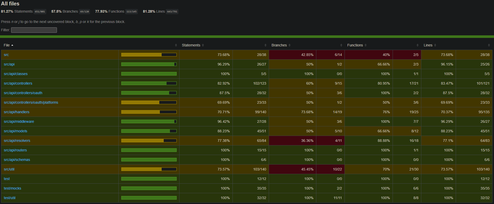
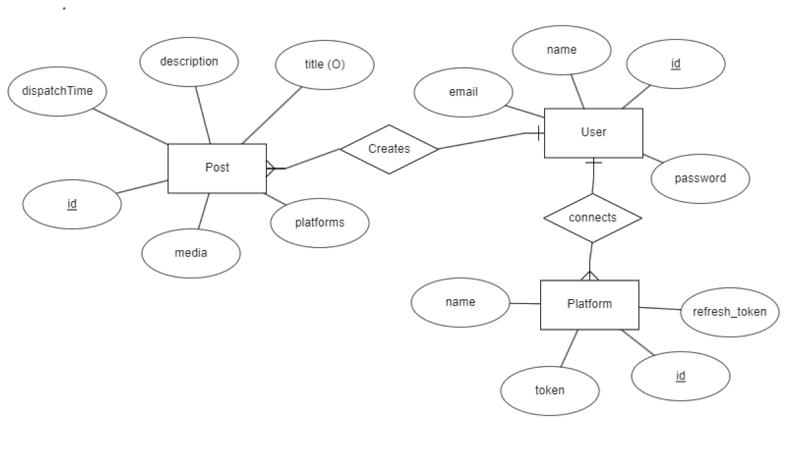
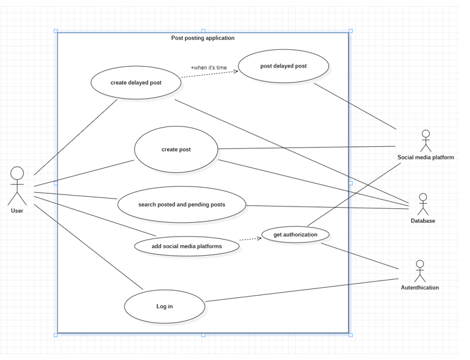
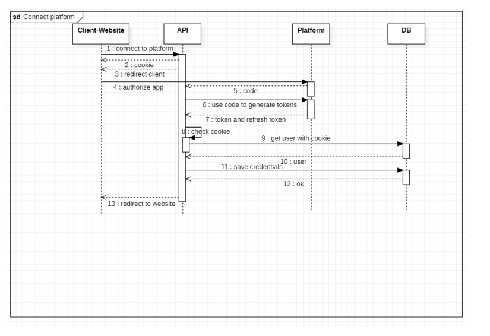
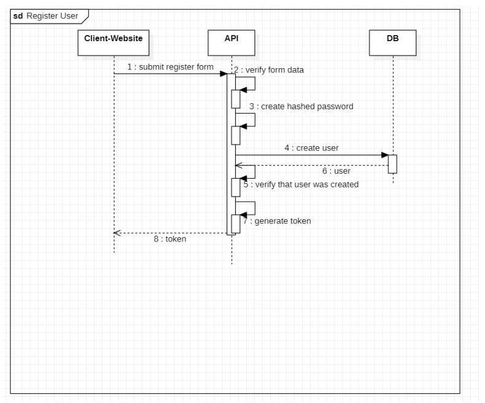
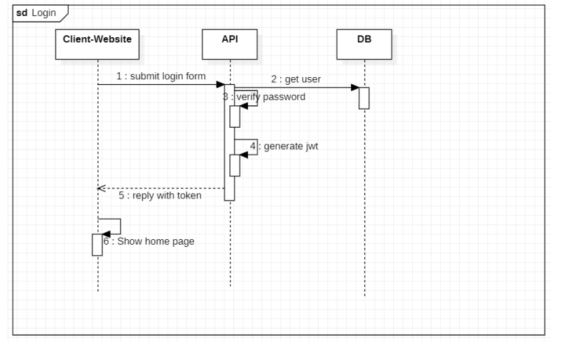
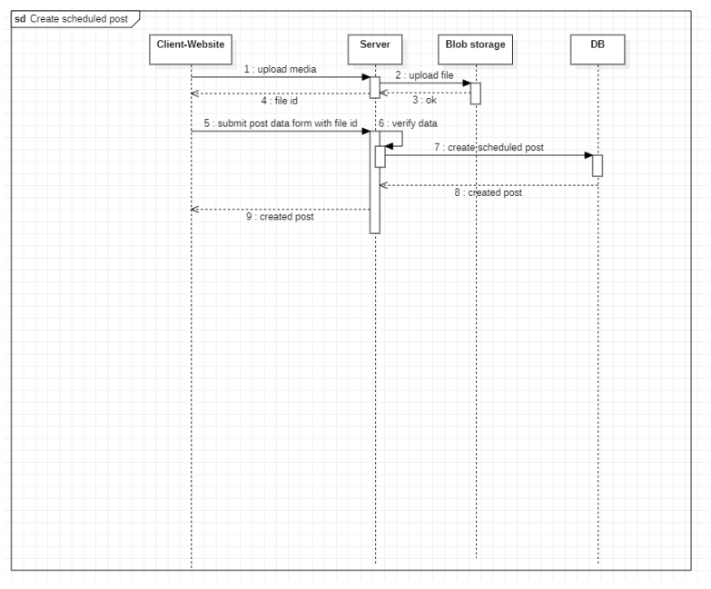

<div id="container">
  </img>
</div>

# PostBuddy


- [PostBuddy](#postbuddy)
  - [Deployments](#deployments)
  - [What the project does](#what-the-project-does)
  - [What are this app's use cases and target audience](#what-are-this-apps-use-cases-and-target-audience)
  - [Usage](#usage)
    - [Backend](#backend)
      - [Installation](#installation)
      - [Running](#running)
    - [Frontend](#frontend)
      - [Installation](#installation-1)
      - [Running](#running-1)
  - [Demos/Screenshots](#demosscreenshots)
  - [Technologies used](#technologies-used)
    - [Backend](#backend-1)
    - [Frontend](#frontend-1)
  - [Testing](#testing)
    - [Test coverage](#test-coverage)
  - [Misc diagrams or other architectural stuff](#misc-diagrams-or-other-architectural-stuff)
  - [Future plans](#future-plans)
  - [Contributors](#contributors)
  - [Related resources](#related-resources)
    - [Useful documentation](#useful-documentation)

## Deployments

The backend is deployed at Azure  
[Graphql sandbox](https://postbuddy-api.azurewebsites.net/graphql)

The website is deployed on Vercel  
[Website](https://postbuddy.vercel.app)

## What the project does

PostBuddy is a web app designed to simplify the process of sharing content across various social media platforms by providing an intuitive and efficient dashboard solution.

## What are this app's use cases and target audience

The purpose for this project is to provide an easy and convenient way for everyone to make and save social media posts to be published simultaneously to different platforms. This app also provides a way to make posts to be published in the future, at the user’s chosen time. This in mind the app is primarily focused towards people who would use sosial media a lot and for people who want to make sure that certain posts will be uploaded at a given time. This app also provides an easy way to store and find posts that you have already made since all the posts are saved and can be also deleted (from our app). This app saves the user’s time if they want to send similar or exactly same posts to many different platforms. By using our app the user only needs to make the post one time and then select all the platforms it will be sent to. The target audience for the app is social media influencers, content creators and companies that promote through social media.

## Usage

To use the website register a new account using the registration form.
In order to create posts using PostBuddy you will also need to connect a Twitter account.
If you don't want to use a real one you can quickly create a throwaway account using [temp-mail](https://temp-mail.org/en/)
service.

[Demos/Screenshots](#demosscreenshots) also showcases the features and usage of this application.

This repository is divided into two subprojects located in the `packages` folder. Currently this folder contains code for the backend and for the frontend.

If you simply wish to use the site or the graphql sandbox,
navigate see [deployments](#deployments)

### Backend

#### Installation

Change your working directory to `packages/backend` and run the command to install all of the dependencies.

```
npm install
```

_You might need to install some other required dependendies like nodemon etc manually which are currently not listed in devDependencies_

#### Running

Before running create a valid `.env` file accoring to the `.env.sample`.
You will not be able to start the development server if any of the variables are missing.

To be able to run the backend you will also need to have a valid blob storage set up on Azure.  
Video compression will not work unless you have [ffpeg](https://ffmpeg.org/) installed

All of the available script are located in the `package.json`. Here are some useful scripts

Development mode

```
npm run dev
```

Build

```
npm run build
```

Clear development database

```
npm run clearDb
```

Tests

```
npm run test
```

or with coverage

```
npm run test:cov
```

### Frontend

#### Installation

Change your working directory to `packages/frontend` and run the command to install all of the dependencies.

```
npm install
```

#### Running

To run in development mode use the command.

```
npm run dev
```

This will also print the address where the website is hosted at,
most likely being http://localhost:5174.

## Demos/Screenshots

Before creating any posts you are required to connect your account to any of the supported social medias.

Logging in:

https://github.com/Jesperilmari/PostBuddy/assets/96197093/e9998b05-dffd-4449-bc1f-12ff521e62b2

Registering an account:

https://github.com/Jesperilmari/PostBuddy/assets/96197093/b4078512-1d48-4de9-93e9-b91e86c55b1f

Connecting twitter:

https://github.com/Jesperilmari/PostBuddy/assets/96197093/14595df8-3160-47fe-9edc-bda6dfe3dd77

Creating a twitter post:

https://github.com/Jesperilmari/PostBuddy/assets/96197093/1e47a52b-04d9-4cdf-b4ed-f61fc92970d8

Creating a scheduled twitter post:

https://github.com/Jesperilmari/PostBuddy/assets/96197093/d3ff2c18-cfdc-4d08-b0a2-c242d919db3e

Changing user information:

https://github.com/Jesperilmari/PostBuddy/assets/96197093/08eda110-576c-460a-9eff-5a94166d2afd

Changing password:

https://github.com/Jesperilmari/PostBuddy/assets/96197093/e99a6bed-659a-44b5-ad2f-e285898e180e

Revoking PostBuddys twitter access:

https://github.com/Jesperilmari/PostBuddy/assets/96197093/61d09ccd-8d26-4437-a0fb-fc9ea725ea6f

## Technologies used

### Backend

- [Express](https://www.npmjs.com/package/express)
- [Mongoose](https://www.npmjs.com/package/mongoose)
- [Oauth](https://www.npmjs.com/package/oauth)
- [cron](https://www.npmjs.com/package/cron)
- [ffmpeg](https://www.npmjs.com/package/ffmpeg)
- [Apollo server](https://www.npmjs.com/package/@apollo/server)
- [jwt](https://www.npmjs.com/package/jsonwebtoken)
- [and more](/packages/backend/package.json)

### Frontend

- [React](https://www.npmjs.com/package/react)
- [Redux](https://redux.js.org/)
- [axios](https://www.npmjs.com/package/axios)
- [Material UI](https://mui.com/)
- [dayjs](https://www.npmjs.com/package/dayjs)
- [and more](/packages/frontend/package.json)

## Testing

Testing for the backend is comprehensive,
containing integration tests for vital endpoints and
unit tests for important components to ensure intended funcionality.

Frontend currently has no tests. This could be a point to improve in
the future.

Parts where coverage is missing have either been manually tested or
are just not correctly displayed in the report.

### Test coverage



Jest was a obvious choice for a test framework.
But we also exploit [ts-mockito's](https://github.com/NagRock/ts-mockito) ability to create mocks of
classes and interfaces with no effort.

Jest's builtin mock function has also proven itself very useful
when mocking entire libraries without needing dependency injection.
Example: [postCreatorHandlers.test.ts](/packages/backend/test/postCreatorHandlers.test.ts)

## Misc diagrams or other architectural stuff









## Future plans

At the momen our app only supports connecting to twitter but our plan is to include all possible social media platforms so tha everyone will be able to use our app in ways that suits them the best. Our next additions will be youtube, instagram, tiktok and reddit. We would also want to provide our users some kind of data of their posting behavior in regards of using our app. A premium version of the app is also in plans that would bring in some new features including but not limited to unlimited storage for videos and posts, support for bigger and longer videos and faster upload speeds, more platforms available at same time (max 3 for non premium), full customer support access through email and many more.

## Contributors

[Jesper Ojala](https://github.com/Jesperilmari)  
[Mikko Tanhola](https://github.com/M1kkoT)  
[Olli Varila](https://github.com/ollivarila)

## Related resources

### Useful documentation

- [Twitter api](https://developer.twitter.com/en/docs/twitter-api)
- [Mongoose](https://mongoosejs.com/docs/)
- [Material UI](https://mui.com/material-ui/getting-started/)
